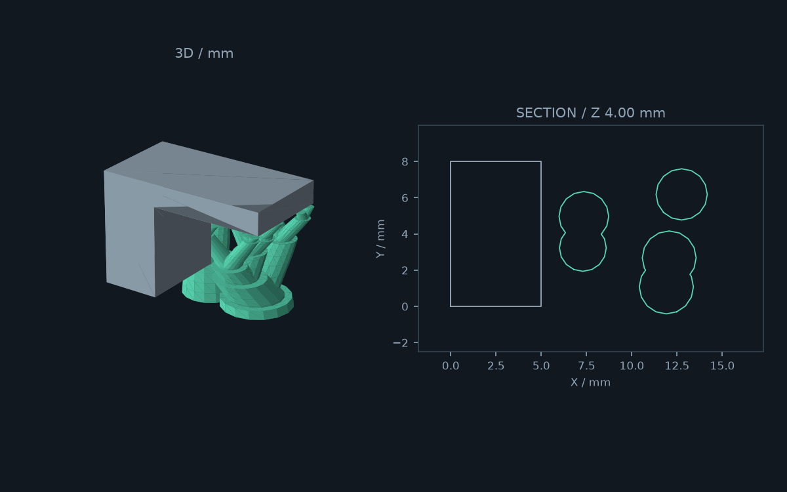
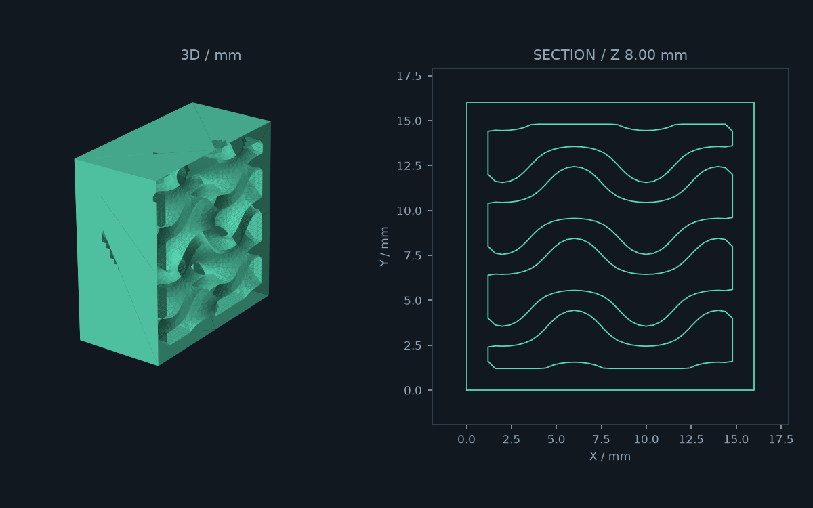

# MeshBloom

STLモデルからツリーサポートや内部格子を生成する、Windows向けのローカルアプリです。
**Simplify3D v5への受け渡し**を最初の対象にした開発版です。G-codeは生成しません。





## 起動

Python 3.10以上（Windows版のTkinterを含む）が必要です。

```powershell
git clone https://github.com/Cola0912/MeshBloom.git
cd MeshBloom
python -m venv .venv
.\.venv\Scripts\python.exe -m pip install -e ".[dev]"
.\launch.ps1
```

または `.\.venv\Scripts\python.exe -m treesupport gui`。
セットアップ済みなら `launch.cmd` をダブルクリックして起動できます。
インストール後は `meshbloom-app` / `meshbloom gui` でも起動できます。
既存の `tree-support-app` / `tree-support-gen` コマンドも互換用に残しています。
STLデータはローカルで処理し、アップロードしません。

## 画面での操作

1. STL / OBJ / 3MFを開く、または「片持ち板デモ」「キューブデモ」「3DBenchy を開く」を選択。
2. ツリーサポート / インフィルを選び、パラメータを設定。
   「標準」「素早く確認」「細かく生成」のプリセットも選べます。
3. 「形状を生成」を押す。計算は別スレッドで実行します。
4. 回転できる3D表示とZスライダーの断面表示で結果を確認。
   「半分を隠して内部を見る」は表示だけに作用します。
5. 「STL一式を書き出す」で出力先を選択。
   毎回新しいサブフォルダーを作るので、元データや前回の結果を上書きしません。

### 表示・姿勢・設定

- プレビューは「3D」「断面」「3D + 断面」を切り替えられます。
  3DはOpenGLで全ての面をGPUに保持し、回転中はカメラだけを更新します。
  上・下・前・後・右・左・斜めからの視点、平行/透視投影、グリッド、メッシュ線に対応。
  インフィル生成後に「外形 / モデル」をOFFにすると格子単体を表示します。
- 左ドラッグで回転、右/中ドラッグまたはShift＋左ドラッグで平行移動。
  ホイールまたは「＋」「−」で拡大縮小、ダブルクリックまたは「全体表示」でフィットします。
  3D画面にフォーカスがあるときは、F/Homeで全体表示、＋/−でズーム、矢印キーで回転できます。
  「画像を保存」で3D画像をPNGに保存できます（断面のみ表示中は断面画像）。
- Z断面はスライダーまたは数値入力で変更できます。浮いたモデルでもZ=0から
  確認できるので、サポートの接地を確認できます。
- X/Y/Zの90度回転、「ベッドに置く」、「元の姿勢に戻す」を用意しました。
  これらの操作は生成済み形状を無効にし、次回のSTL出力に反映されます。
- 「設定を保存」「設定を開く」で生成パラメータをJSONとして共有・再利用できます。
  モデルデータや姿勢は設定ファイルに含みません。
- 生成中は現在の工程・経過時間を表示します。「生成を中止」は工程の区切りで
  停止します。大きな断面解析やBoolean処理の途中では即時停止できません。
  保存中の終了操作は、書き込み完了後にウィンドウを閉じます。
- `Ctrl+O`: モデルを開く / `F5`: 生成 / `Ctrl+S`: STLを書き出す。
  書き出し後は「保存先フォルダーを開く」で結果を確認できます。

入力は**mm、Z=0がビルドプレート**です。元の座標を保持します。
読み込むだけでは座標を変更しません。単位変換は入力前にCADで行ってください。
姿勢調整は上記の明示的な操作で行います。モデルを浮かせたまま支える場合は
「ベッドに置く」を使わず、その位置でサポートを生成してください。
閲覧では穴あきメッシュも開けます。サポート・インフィル生成には閉じたソリッドが必要です。
自己交差を含む複雑な不正メッシュの自動修復は未対応です。

### ノズル・ライン幅・接触部

「ノズル径」「ライン幅」を入力し、「ライン幅を太さに適用」を押すと、先端径・枝径・
接触径・インフィルと外殻の厚みを設定します。ライン幅0はノズル径の1.125倍です。
明示したライン幅はノズル径とは独立して変更できます。値の入力だけでは各寸法を
上書きせず、適用後も寸法欄で個別調整できます。

| 寸法 | 太さへ適用したときの値 |
|---|---|
| 先端径 / 接触面径 | ライン幅の2倍 / 1倍 |
| 枝の基準径 / 最大径 / 根元径 | ライン幅の5倍 / 20倍 / 8倍 |
| 格子厚み / 外殻厚み | ライン幅の3倍 |
| 接触部の高さ | ノズル径の2倍 |

- `organic`は、先端から基準枝径へ滑らかに太くなり、その後は「枝の太り角度」に
  従って成長します。衝突・到達可能領域による制約を受け、合流済みの枝を細くしません。
  `linear`は従来の一定の直径増加率です。
- 「先端Zギャップ」「側面ギャップ」でモデルとの距離を指定します。Zギャップは
  レイヤー高さ単位に切り上げ、最低1層分を空けます。生成後にギャップ下限を表示します。
- 接触形状は`flat`（円柱状の接触部）、`tapered`（絞った先端）、`rounded`（丸い肩）。
  どれも頂部には指定接触径の平面を残します。丸みを上へ追加せず、元の安全な枝形状の
  内側で加工します。合流点に近い短い枝では接触部の高さを短縮します。
- 接触径0は先端径を使用。接触径はライン幅以上、先端径以下にしてください。
- ノズル設定・形状・寸法は設定JSON v2と出力レポートに保存します。従来のv1設定も
  読み込めます。旧設定の枝径プロファイルは`linear`を保持します。

STLは材料の形状です。実際の押出ライン幅はSimplify3D側でも設定してください。
格子や円形断面の厚みがライン幅の整数倍でも、スライサーの押出経路本数を保証するものではありません。
参照したアルゴリズムと対応範囲は[ツリーサポートの設計](docs/TREE_SUPPORT_METHOD.md)に記載しています。

### 同梱の3DBenchy

ユーザー提供の `3DBenchy.stl` を [パッケージ内](src/treesupport/assets/3DBenchy.stl) に同梱しています。
GUIの「3DBenchy を開く」から読み込めます。約60×31×48 mm、約22.6万面のモデルです。
元ファイルをそのまま保存し、読み込み時だけ、同じ頂点を参照するゼロ面積の面552枚を
除外します。頂点座標や通常の表面は変更しません。
同梱モデルの出典・ライセンス・ハッシュは[モデルの説明](src/treesupport/assets/README.md)を参照。
高密度メッシュのため、生成は小さなデモより時間がかかります。

## 出力ファイル

| モード | ファイル | 用途 |
|---|---|---|
| 共通 | `model.stl` | 入力モデル。GUIで姿勢を変更した場合は変更後の座標 |
| サポート | `tree_support.stl` | Boolean union済みのサポートのみ |
| サポート | `model_with_support.stl` | モデルとサポートを同じSTLに格納。相対位置を保持 |
| インフィル | `infill_only.stl` | 格子単体。確認・独自ワークフロー用 |
| インフィル | `model_with_infill.stl` | 元の外形を保持し、外殻と格子を一体化した印刷用モデル |
| 共通 | `report.json` | パラメータ・体積・検証結果・警告 |
| 共通 | `Simplify3D-v5.txt` | スライサーへの受け渡し手順 |

サポートが生成されなければ空のSTLは書き出さず、レポートに記録します。
到達不能なオーバーハングや枝の刈り込みは警告として表示します。

## Simplify3D v5で使う

### ツリーサポート

最初は `model_with_support.stl` を1つだけ読み込みます。
スライサーではサポートも通常の印刷形状です。自動サポートはOFFにし、
アプリで指定したものと同じレイヤー高さでスライスしてください。
初回は材料部分の充填率100%を出発点にすると、太い枝の中空化を避けて確認できます。
モデルと枝を別々の充填率にするには、別STLとして読み込み、原点を合わせて
別プロセスを割り当てます。

別STLの場合、`Edit > Align Selected Model Origins` で座標を合わせ、
グループ化して配置します。個別の自動配置やベッドへの落下は相対Z位置を変えるため
避けます。浮いた元モデルは、枝と一緒に配置してください。

先端のZギャップ、最下層の接地、細い枝の押出、サポートの被覆をプレビューで確認します。
アプリ側のサポートはビルドプレートに着地するものに限定しています。

### インフィル

`model_with_infill.stl` だけを読み込みます。元のモデルを重ねると内部空洞が
埋まってしまうため、`model.stl` を追加しないでください。

ここでのインフィルはSTLにある実体です。**材料部分の充填率100%**を出発点にします。
0%では格子や外殻そのものの中まで中空になる可能性があります。
「内部の空洞」はメッシュ形状で指定されており、充填率100%でも通常は空洞として
残るはずですが、修復設定や薄壁設定による処理を各レイヤーで確認してください。
自動サポートはOFFにし、空洞を埋める修復設定は使わないでください。
薄壁が消える場合は押出幅・単線押出の設定と格子厚を調整します。

パターンは次の3種類です。

- `gyroid`: 厚みを持つジャイロイド周期曲面。
- `diamond`: 厚みを持つダイヤモンド周期曲面。
- `cubic`: X・Y・Z方向の丸棒をつないだ立体格子。

スライサー内蔵のパターンやその押出経路を完全再現するものではありません。
`wall_thickness`は曲面では局所勾配から近似した厚み、cubicでは棒の直径です。
セルサイズと厚みで構造を調整し、密度は外殻込みの実測体積比で表示します。
`infill_only.stl`は外殻の内側半分まで入り込む構造で、単体表示や独自の合成処理用です。

**Simplify3D v5での実スライス・実機試験は未実施です。**
対応はSTLの幾何生成と検証までです。小さな試験片から確認してください。
S3D v5にはカスタム3Dモデルを使うサポート機能もありますが、その固有ワークフローは
本アプリではまだ検証していません。

公式情報:

- [モデルの選択とグループ化](https://www.simplify3d.com/resources/videos/selecting-grouping-models/)
- [薄壁と小さな形状の印刷](https://www.simplify3d.com/resources/articles/printing-thin-walls-and-small-features/)
- [Version 5.0の機能](https://www.simplify3d.com/products/simplify3d-software/whats-new/version-5-0/)

## CLI

```powershell
meshbloom support model.stl -o out --layer-height 0.2 --top-z-gap 0.2 --xy-gap 0.4
meshbloom infill model.stl -o out --pattern gyroid --cell-size 8 --wall-thickness 1.2 --shell-thickness 1.2 --pitch 0.4
```

失敗時は終了コード1、引数エラーは2。成功時は保存先・ファイル名・警告をJSONで標準出力へ、
進捗は標準エラー出力へ書き出します。

## 実装と制約

- 既存の断面解析・領域伝播・枝の合流処理を利用。
- メッシュの水平リングでZ方向のはみ出しを抑え、Manifoldで枝を結合。
- インフィルはモデルの符号付き距離と周期場を格子点で評価し、Marching Cubesで空洞を
  生成して元モデルからBoolean差分。外形の再メッシュ化を避けています。
- インフィルは最大200万格子点まで。解像度は壁厚・外殻厚の1/3以下、1セル12点以上。
  大型・高ポリゴンモデルでは時間・メモリを要します。
- 厚みとギャップの保証には離散化の限界があります。曲面の薄い突起、微細な穴、
  レイヤー内だけに現れるオーバーハングは厳密な連続形状検証の対象外です。
- サポート検証は接続・角度・レイヤー断面の距離・メッシュ頂点の距離・閉じた体積を
  調べます。全三角形同士の交差や実際の押出経路を網羅的に保証しません。
- 3D表示はOpenGL対応のグラフィックスドライバーが必要です。Windowsで確認しています。
  全ての面を保持するため、非常に大きなモデルの読み込みとGPUメモリー使用量は面数に依存します。
- ライトニング、適応密度、モデル上着地、複数材料、EXE配布は未実装。

## 検証

```powershell
.\.venv\Scripts\python.exe -m pytest
```

既存の幾何テストに加え、内部空洞・既存の穴・外形・サポートのZ範囲・モデルとの非交差・
STL再読み込み・CLI・不正な設定の拒否を検証します。
